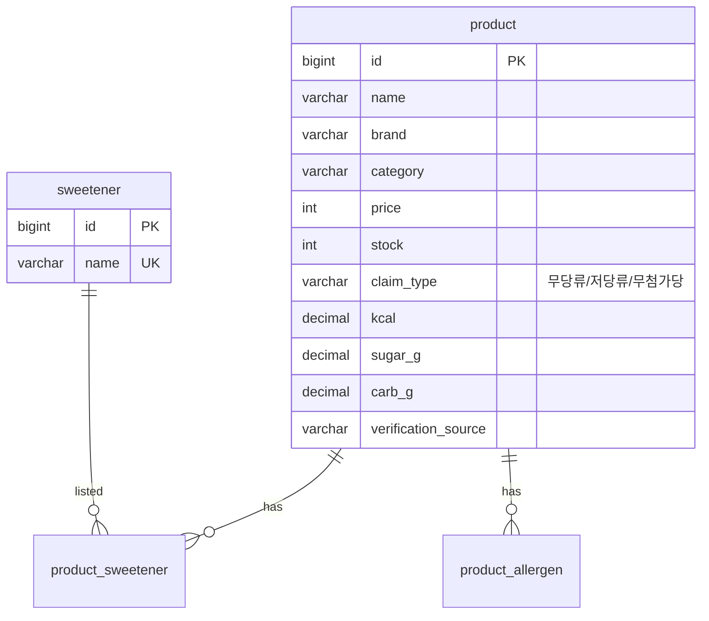
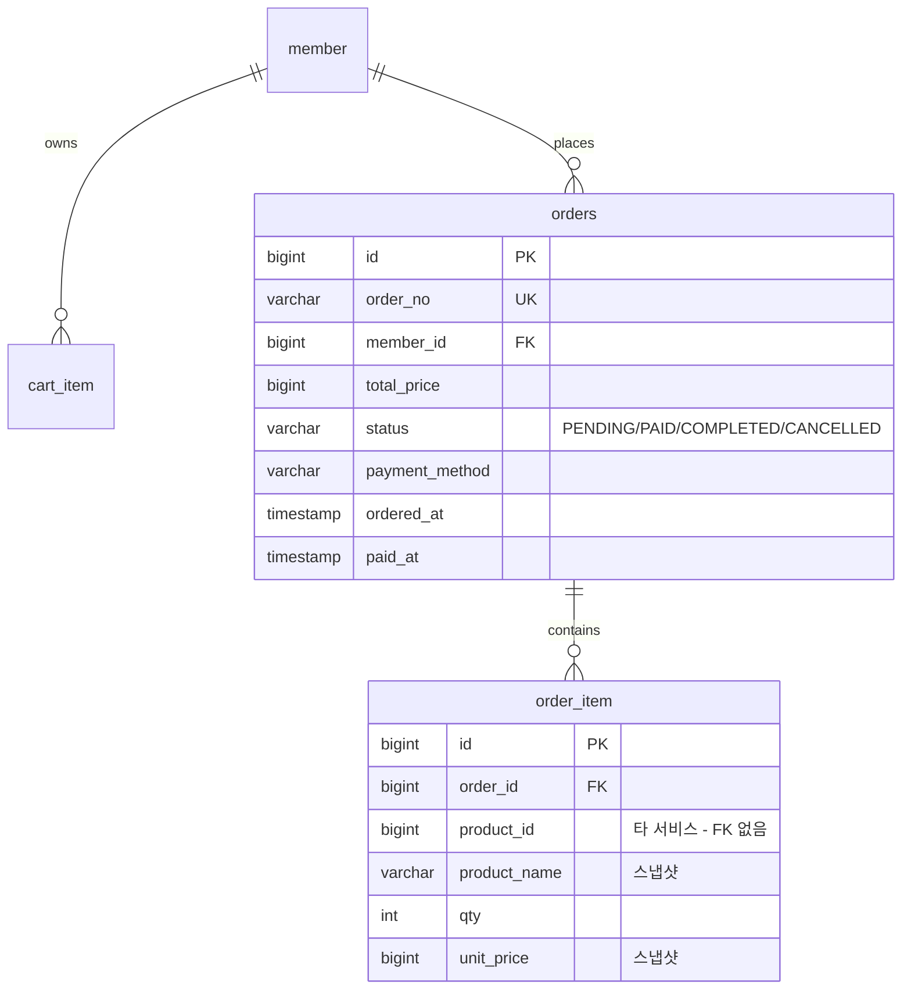
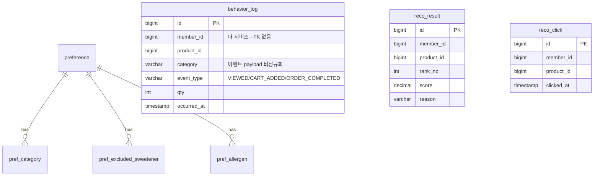

# ERD · 테이블 명세서

서비스별 DB 분리(Database per Service). 서비스 간 참조(`product_id`, `member_id`)는 FK 없이 값만 보관하고,
필요한 정보는 OpenFeign 으로 조회한다. DDL 은 `sql/` 폴더에 있으며 H2(MariaDB 모드)로 실행 검증됐다.

## product_db — product-service (:8081)

감미료는 필터 대상이라 문자열 컬럼이 아니라 **마스터 + 조인 테이블**로 둔다
(`sweetenerExclude=말티톨` 검색이 인덱스를 타야 한다). 알레르기도 같은 패턴.

## commerce_db — commerce-service (:8082)

- 주문 상태머신: `PENDING`(생성) → `PAID`(결제 승인 + 재고 차감 + 이벤트 발행) → `COMPLETED`. 차감 실패 시 `CANCELLED`.
- `order_item.product_name`·`unit_price` 는 **주문 시점 스냅샷** — 상품 정보가 바뀌어도 주문 내역은 불변.

## reco_db — recommendation-service (:8083)

- `behavior_log.category` 는 이벤트 payload 값을 그대로 저장(비정규화) — 카테고리 가중치 계산 때
  product-service 를 호출하지 않기 위함.
- `rank` 는 MariaDB 예약어라 `rank_no` 사용.
- `reco_click` 은 선택 6번(추천 성과 대시보드)의 클릭률 집계용.

## 채점 항목 대응

| 항목 | 반영 |
|---|---|
| 핵심 8 — 서비스별 DB 분리 및 ERD | 스키마 3개 분리, 교차 FK 없음 |
| 핵심 7 — 주문 시 재고 차감 | orders.status 상태머신 + product.stock CHECK(>=0) |
| 핵심 6 — 행동 이벤트 3종 반영 | behavior_log.event_type 3종 CHECK |
| 선택 6 — 성과 대시보드 | reco_click, reco_result |
